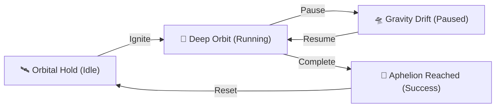

<div align="center">

# 🌌 T-Nebula
### *Navigate your focus sessions through the deep gravity fields of the cosmos.*

[](https://react.dev/)
[](https://www.typescriptlang.org/)
[](https://vite.dev/)
[](https://threejs.org/)
[](https://tailwindcss.com/)

</div>

---

## 🪐 Tentang T-Nebula

**T-Nebula** adalah aplikasi *focus timer* (Pomodoro) imersif berbasis web yang mengombinasikan ketenangan luar angkasa dengan estetika kosmik modern. Alih-alih menggunakan pengukur waktu biasa, **T-Nebula** mengajak Anda untuk mengorbit di sekitar planet pilihan Anda, memicu *flow-state* melalui visualisasi gravitasi dan efek bintang dinamis.

> [!NOTE]
> Proyek ini dirancang khusus dengan perpaduan **React 19**, **Three.js** untuk simulasi 3D planet yang mulus, dan **Framer Motion** untuk menghadirkan mikro-animasi antarmuka kelas premium.

---

## 🚀 Fitur Utama Kosmik

*   **🪐 Orbital Planet Selector**  
    Pilih tujuan orbit Anda dari 8 planet di Tata Surya. Setiap planet dirender secara 3D dengan tekstur unik dan memancarkan radiasi warna aksen yang berbeda.
*   **🌌 Dynamic Parallax Starfield**  
    Efek latar belakang bintang yang bereaksi secara interaktif terhadap gerakan kursor mouse, memberikan kedalaman visual dimensi ruang angkasa yang nyata.
*   **🌀 Interactive Gravity Field**  
    Ketika waktu fokus dimulai (*Deep Orbit*), partikel cincin gravitasi di sekitar planet akan berputar menyesuaikan sisa waktu Anda untuk memberikan umpan balik visual yang menenangkan.
*   **✨ Cosmic Sparkle Trails**  
    Jejak partikel bercahaya yang mengikuti fokus Anda, menghadirkan estetika premium pada alur kerja produktivitas Anda.
*   **⚙️ Custom Quantum Configuration**  
    Sesuaikan durasi fokus Anda secara fleksibel menggunakan konsol pengaturan orbital.

---

## 🎨 Spektrum Energi Planet (Accent Themes)

Setiap planet memancarkan warna energi unik yang akan mengubah seluruh skema warna antarmuka aplikasi saat dipilih:

| Planet | Kode Warna Aksen | Representasi Kosmik |
| :---: | :---: | :--- |
| **Merkurius** | `#c0b8b0` | Energi Batuan Klasik & Tenang |
| **Venus** | `#f0b858` | Radiasi Awan Asam & Hangat |
| **Bumi** | `#4ba3e3` | Kehidupan & Oase Biru Hidrogen |
| **Mars** | `#e05a47` | Debu Oksida Besi & Semangat Membara |
| **Jupiter** | `#d4a373` | Raksasa Gas & Badai Oranye Raksasa |
| **Saturnus** | `#e2c391` | Cincin Es Megah & Cahaya Keemasan |
| **Uranus** | `#70d6d4` | Es Metana & Ketenangan Toska |
| **Neptunus** | `#4d79ff` | Badai Biru Kobalt & Kedalaman Kosmik |

---

## 📂 Arsitektur Orbital (Struktur Folder)

Struktur komponen utama dirancang secara modular untuk efisiensi rendering:

```text
src/
 ├── components/
 │    ├── CosmicTimer.tsx      # Reaktor inti pengatur logika & state timer
 │    ├── PlanetRenderer.tsx   # Mesin visual 3D Planet (Three.js WebGL)
 │    ├── GravityField.tsx     # Generator orbit partikel melingkar
 │    ├── CosmicStar.tsx       # Bintang pemancar status fokus (Idle, Running, Success)
 │    ├── SparkleTrail.tsx     # Jejak partikel interaktif
 │    └── SettingsModal.tsx    # Konsol kontrol parameter durasi & planet
 ├── hooks/
 │    └── useSettings.ts       # Pusat kendali penyimpanan state & preferensi
 ├── index.css                # Desain sistem & token warna luar angkasa
 └── App.tsx                  # Pintu gerbang utama aplikasi
```

---

## 🛸 Cara Meluncur (Panduan Instalasi)

Pastikan Node.js terinstal di sistem Anda sebelum memulai peluncuran.

### 1. Kloning Repositori
```bash
git clone https://github.com/username/t-nebula.git
cd t-nebula
```

### 2. Isi Bahan Bakar (Instalasi Dependensi)
```bash
npm install
```

### 3. Luncurkan Mesin (Mode Pengembangan)
```bash
npm run dev
```
Setelah mesin menyala, buka **`http://localhost:5173`** pada peramban Anda untuk memulai simulasi orbit.

---

## 🛡️ Orbital State Workflow

Alur fokus didefinisikan ke dalam empat kondisi kuantum:



---

<div align="center">
  <sub>Dibuat dengan 💜 untuk para Penjelajah Produktivitas Kosmik.</sub>
</div>
