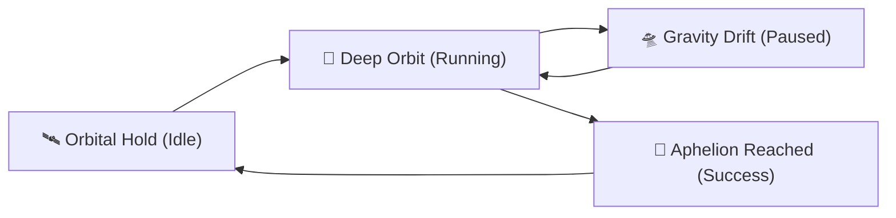

**T-Nebula** adalah aplikasi *flow-state timer* (Pomodoro) bertema kosmik yang dirancang untuk membantumu menjelajahi sesi fokus layaknya mengorbit di luar angkasa. Pilih planetmu, aktifkan gravitasi fokus, dan capai *aphelion* produktivitasmu.

---

## 🚀 Fitur Utama

- 🪐 **Cosmic Planet Selection**  
  Pilih dari berbagai planet (Merkurius, Venus, Bumi, Mars, Jupiter, Saturnus, Uranus, Neptunus) dengan skema warna aksen dinamis yang unik.
- 🌌 **Parallax Space Background**  
  Latar belakang bintang interaktif yang bergerak dinamis mengikuti pergerakan kursor mouse.
- 🌀 **Gravity Field & Sparkle Trails**  
  Visualisasi partikel gravitasi dan efek cahaya (*sparkle*) yang memukau saat timer berjalan, memperkuat nuansa imersif luar angkasa.
- ⏱️ **Orbital Duration Settings**  
  Sesuaikan durasi waktu fokusmu melalui panel pengaturan kosmik yang modern dan futuristik.

---

## 🎨 Spektrum Energi Planet (Accent Themes)

Setiap planet memancarkan warna energi unik yang akan mengubah seluruh skema warna antarmuka aplikasi saat dipilih:

| Planet | Warna Aksen | Representasi Kosmik |
| :---: | :---: | :--- |
| **Merkurius** | `#c0b8b0` | Energi Batuan Klasik & Tenang |
| **Venus** | `#f0b858` | Radiasi Awan Asam & Hangat |
| **Bumi** | `#4ba3e3` | Kehidupan & Oase Biru Hidrogen |
| **Mars** | `#e05a47` | Debu Oksida Besi & Semangat Membara |
| **Jupiter** | `#d4a373` | Raksasa Gas & Badai Oranye Raksasa |
| **Saturnus** | `#e2c391` | Cincin Es Megah & Cahaya Keemasan |
| **Uranus** | `#70d6d4` | Es Metana & Ketenangan Toska |
| **Neptunus** | `#4d79ff` | Badai Biru Kobalt & Kedalaman Kosmik |

---

## ⚙️ Cara Menjalankan Project

Ikuti langkah-langkah di bawah ini untuk menjalankan **T-Nebula** di mesin lokalmu:

### 1. Kloning Repositori
```bash
git clone https://github.com/AdhNaufall/T-Nebula.git
cd t-nebula
```

### 2. Instalasi Dependensi
```bash
npm install
```

### 3. Jalankan Server Pengembangan
```bash
npm run dev
```
Setelah dijalankan, buka `http://localhost:5173` di browsermu.

---

## 🔮 State Orbital

Aplikasi ini memiliki 4 fase utama dalam perjalanan fokusmu:



- 🛰️ **Orbital Hold (Idle)** — Memilih planet tujuan dan bersiap melakukan peluncuran.
- 🚀 **Deep Orbit (Running)** — Mode fokus aktif dengan visualisasi kosmik berjalan.
- 🛸 **Gravity Drift (Paused)** — Orbit terhenti sementara waktu.
- 🌟 **Aphelion Reached (Success)** — Misi selesai! Sesi fokus berhasil diselesaikan.
